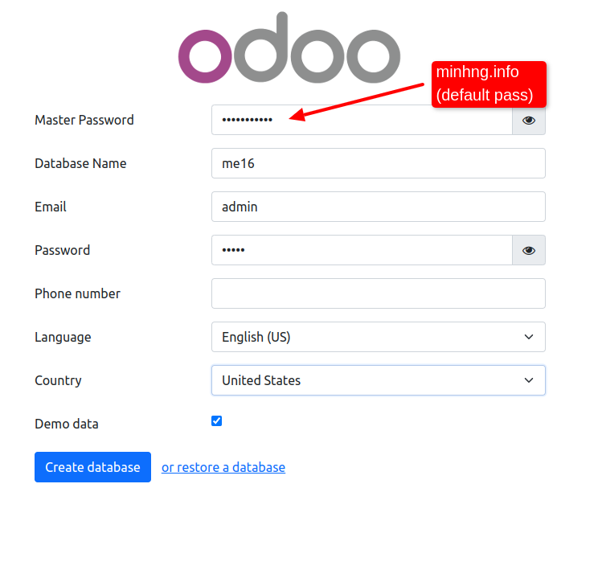
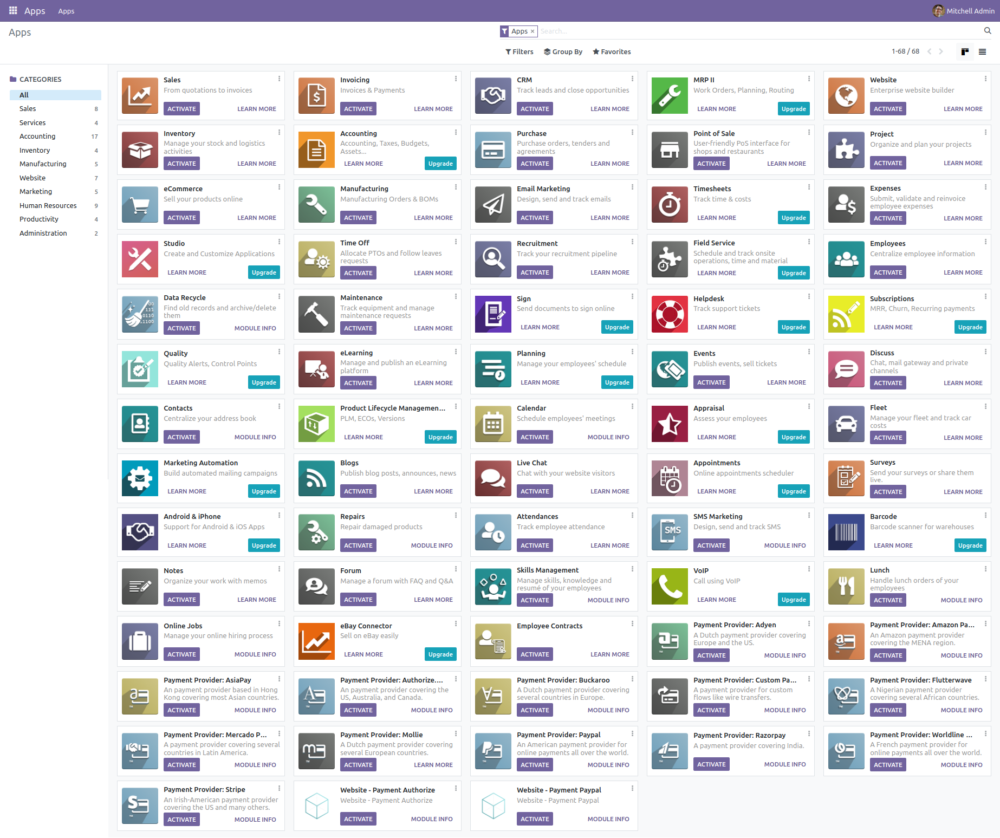
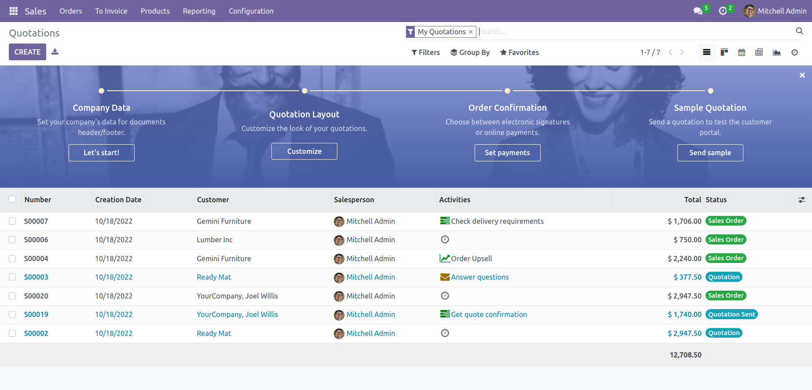
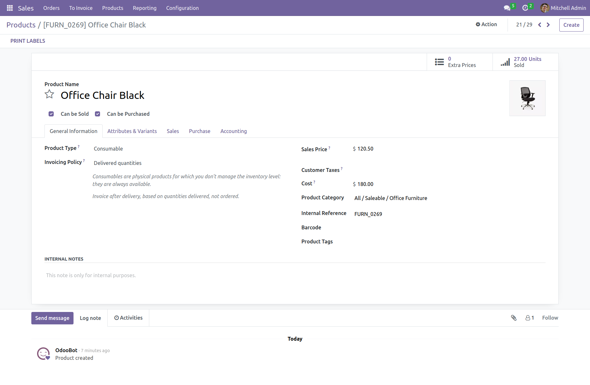

# Installing Odoo 16.0 with one command (Supports multiple Odoo instances on one server).

## Quick Installation

Install [docker](https://docs.docker.com/get-docker/) and [docker-compose](https://docs.docker.com/compose/install/) yourself, then run the following to set up first Odoo instance @ `localhost:10016` (default master password: `minhng.info`):

``` bash
curl -s https://raw.githubusercontent.com/minhng92/odoo-16-docker-compose/master/run.sh | sudo bash -s odoo-one 10016 20016
```
and/or run the following to set up another Odoo instance @ `localhost:11016` (default master password: `minhng.info`):

``` bash
curl -s https://raw.githubusercontent.com/minhng92/odoo-16-docker-compose/master/run.sh | sudo bash -s odoo-two 11016 21016
```

Some arguments:
* First argument (**odoo-one**): Odoo deploy folder
* Second argument (**10016**): Odoo port
* Third argument (**20016**): live chat port

If `curl` is not found, install it:

``` bash
$ sudo apt-get install curl
# or
$ sudo yum install curl
```

## Usage

Start the container:
``` sh
docker-compose up
```
Then open `localhost:10016` to access Odoo 16.0.

- **If you get any permission issues**, change the folder permission to make sure that the container is able to access the directory:

``` sh
$ sudo chmod -R 777 addons
$ sudo chmod -R 777 etc
$ sudo chmod -R 777 postgresql
```

- If you want to start the server with a different port, change **10016** to another value in **docker-compose.yml** inside the parent dir:

```
ports:
 - "10016:8069"
```

- To run Odoo container in detached mode (be able to close terminal without stopping Odoo):

```
docker-compose up -d
```

- To Use a restart policy, i.e. configure the restart policy for a container, change the value related to **restart** key in **docker-compose.yml** file to one of the following:
   - `no` =	Do not automatically restart the container. (the default)
   - `on-failure[:max-retries]` =	Restart the container if it exits due to an error, which manifests as a non-zero exit code. Optionally, limit the number of times the Docker daemon attempts to restart the container using the :max-retries option.
  - `always` =	Always restart the container if it stops. If it is manually stopped, it is restarted only when Docker daemon restarts or the container itself is manually restarted. (See the second bullet listed in restart policy details)
  - `unless-stopped`	= Similar to always, except that when the container is stopped (manually or otherwise), it is not restarted even after Docker daemon restarts.
```
 restart: always             # run as a service
```

- To increase maximum number of files watching from 8192 (default) to **524288**. In order to avoid error when we run multiple Odoo instances. This is an *optional step*. These commands are for Ubuntu user:

```
$ if grep -qF "fs.inotify.max_user_watches" /etc/sysctl.conf; then echo $(grep -F "fs.inotify.max_user_watches" /etc/sysctl.conf); else echo "fs.inotify.max_user_watches = 524288" | sudo tee -a /etc/sysctl.conf; fi
$ sudo sysctl -p    # apply new config immediately
``` 

## Custom addons

The **addons/** folder contains custom addons. Just put your custom addons if you have any.

## Odoo configuration & log

* To change Odoo configuration, edit file: **etc/odoo.conf**.
* Log file: **etc/odoo-server.log**
* Default database password (**admin_passwd**) is `minhng.info`, please change it @ [etc/odoo.conf#L60](/etc/odoo.conf#L60)

## Odoo container management

**Run Odoo**:

``` bash
docker-compose up -d
```

**Restart Odoo**:

``` bash
docker-compose restart
```

**Stop Odoo**:

``` bash
docker-compose down
```

## Live chat

In [docker-compose.yml#L21](docker-compose.yml#L21), we exposed port **20016** for live-chat on host.

Configuring **nginx** to activate live chat feature (in production):

``` conf
#...
server {
    #...
    location /longpolling/ {
        proxy_pass http://0.0.0.0:20016/longpolling/;
    }
    #...
}
#...
```

## docker-compose.yml

* odoo:16.0
* postgres:15

## Odoo 16.0 screenshots after successful installation.








